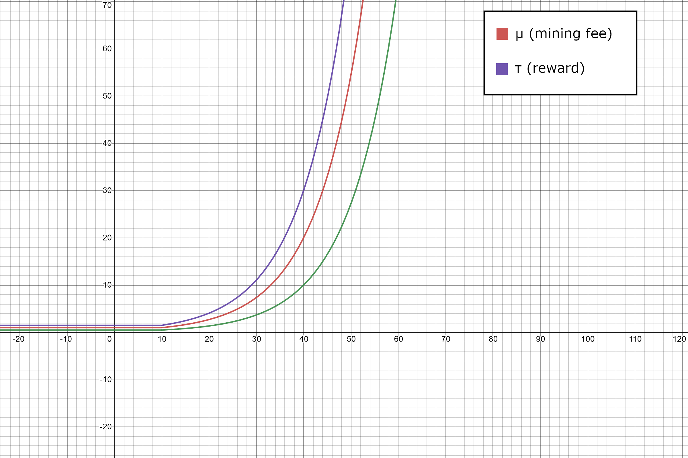

# The IceCereum Network - How Coins Are Introduced

Almost every blockchain / cryptocurrency use miners to introduce coins into the
system. The IceCereum Network at the moment has only one miner and plans to have
only one miner. I know this sounds hella scuffed and that this miner can take
over the network if it wanted to, but it won't because there's no monetary value
attached to the coin. The reason why this network doesn't have more miners is
because I didn't want to implement the network syncing protocols and the such.
This was purely for meme sake. But even for a
somewhat-elaborate-and-slightly-shitty meme, some things had to be set in stone -
how coins are introduced into the system.

"So," you ask, "how _do_ you introduce coins in this system?"

Instead of introduction-of-coins-by-using-miners (something I just made up),
this networks uses
introduction-of-coins-by-rewarding-a-percentage-of-transactions-randomly. Yeah,
a mouthful. In one sentence: the network rewards _some_ transactions in the
TXPOOL with _some_ coins to introduce coins into the system.

### Definitions:

Bn: The nth block in the chain

TXPOOL: A pool of all the current transactions that have not been added to the
blockchain

R: The number of transactions in the previous block i.e., the number of
transactions in the Bn-1 block, assuming we are about to create the
Bn block.

ρ: The percentage of transactions rewarded

μ: The mining fee to be set for this TXPOOL

τ: The reward for transactions that are chosen to be rewarded. This reward goes
to the sender

T: The amount of time the TXPOOL accepts transactions before converting into a
block

### The Goal:

The goal is to determine μ (mining fee) and τ (reward) for the current TXPOOL
based on R, the number of transcations in the previous block Bn-1.

### Calculations & Constants:

T is defined to be 3 hours. This means that every three hours, all the
transactions in a TXPOOL are converted into a block. Although this may seem
like a long time, I don't think that there are users who will use this on a
<s>daily</s> <s>weekly</s> <s>monthly</s> yearly basis.

ρ is defined to be 0.1 i.e., 10% of all the transactions in the TXPOOL will be
rewarded with τ coins.

μ is defined to be:

  - 1, R < 10
  - e^(R-10) / 10, R &GreaterEqual; 10

τ is defined to be (1.5 * μ) i.e.,

  - 1.5, R < 10
  - 1.5 * e^(R-10) / 10, R &GreaterEqual; 10

### Some Things To Note:

When the number of transactions in the TXPOOL are less than 10, the method for
determining whether a random transaction is rewarded is based on a random number
generated between 0 and 1. If the generated random number is below ρ, then 1
random transaction will be rewarded. Otherwise, no transaction is rewarded.

Initially, a thought that I had that would potentially hinder the network was
users spamming a lot of transactions in the hopes that they would get a reward.
This reward would be spent on mining fees on the next couple of transactions
to get some more rewards and somehow be able to create infinite money. After a
bit of thinking and after coming up with the definitions above, I plotted some
graphs to visualise this scenario.

The red line is the mining fee, μ.

The purple line the reward, τ.

Since τ > μ, specifically since τ = 1.5μ, the spammer will be able to initiate
one more transaction and will be left 0.5μ if the new transaction does not have
a reward. This is the green line. For the second transaction to have a reward,
the spammer needs to have ρ * ρ luck i.e., 1 in 100 odds (as ρ = 0.1) which
would let them be able to initiate yet another transaction. For n consecutive
transactions to have rewards, the odds need to be ρ ^ n; this is a very low
figure which can only be found in dreams. All this back-of-the-napkin math says
that 2 or 3 consecutive transactions being rewarded is going to be rare and a
person looking to abuse/exploit this system would end up losing money very
quickly.

This is for transactions in the **same** TXPOOL. This does not take into
consideration another case which is more likely to happen which is explained
chronologically below:

- Bn-2 Block:
  - Many transactions are made during this time period
- Bn-1 Block:
  - Since there were many transactions in the previous block (Bn-2):
    - The mining fee μ is very high
    - The reward τ is also very high
  - There are only a few transactions in this block as the mining fee μ is very
  high
  - A spammer gets rewarded a very high τ once and does not initiate any more
  transactions
- Current TXPOOL for Bn Block:
  - Since there were a few transactions in the previous block (Bn-1):
    - The mining fee μ is low
    - The reward τ is also low

The spammer in this case has a lot more coins from the reward of the
Bn-1 Block to spend for the spammy transactions of the current block
with a low mining fee.

Although this case is possible, it's not very probable. The spammer would have
to risk a lot of coins for the mining fee in the hopes of getting a reward.