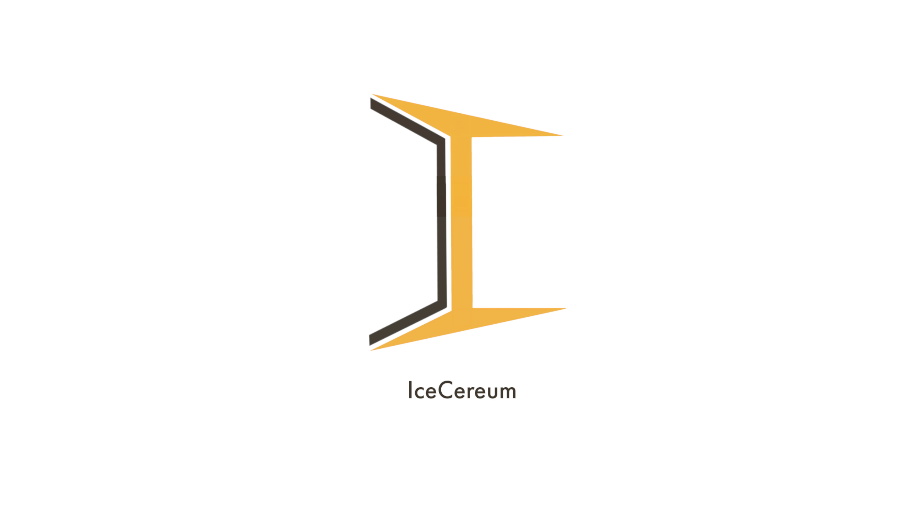

# The IceCereum Network Docs

This repository has some documents that sort of explain how this network works.
Before you delve into that, read the below 'rules'.

### First

This cryptocurrency is **private**. This means that only people who are invited
by me or by people on the network to participate are allowed to participate. If
you know someone on the network who is willing to give you coins, ask them. If
you know me well enough to ask for some coins, shoot me an email. This coin was
created as a meme to be used amongst my friends and people I know.

### Second

This coin has **no** real worth. You cannot buy it or sell it for actual money.
As the creator of this coin, I would prefer this remain as long as the coin
exists. You will not find this on any marketplace.

### Third

This coin, protocol and other repositories will most probably not be receiving
updates unless there's some major bug that I overlooked. It will remain the same
as is after being deployed. If you _do_ find any bugs, you can raise an
[issue](https://github.com/IceCereum/Docs/issues) and hope that I read it.

## This Repository

This repository contains three documents:

1. [A Beginner's Guide](./A-Beginners-Guide.md)
2. [How Coins Are Introduced](./How-Coins-Are-Introduced.md) into the system
3. [API protocol](./API-protocol.md) (you probably don't need to read this; this
is just for my reference)